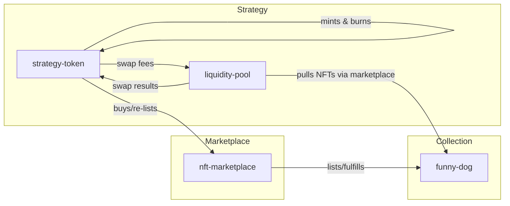

# Clarity Workspace

Smart-contract suite backing the Rather Strategy front-end. Contracts are organised as a Clarinet project with TypeScript-based vitest tests.

## Contracts overview

- **funny-dog.clar** – SIP-009 NFT collection with sequential minting, URI builder, and collection cap.
- **nft-marketplace.clar** – Minimal STX-only marketplace for listing, cancelling, and fulfilling NFTs.
- **strategy-token.clar** – SIP-010 fungible token (RATHER) plus treasury logic, NFT relisting, and swap-triggered burns.
- **liquidity-pool.clar** – XYK pool for STX⇄RATHER swaps, captures swap fees and forwards them to the strategy.
- **traits/liquidity-pool-trait.clar** – Trait shared between strategy contract and pool.

## Architecture



## Directory map

```
contracts/
├── funny-dog.clar
├── liquidity-pool.clar
├── nft-marketplace.clar
├── strategy-token.clar
└── traits/
		└── liquidity-pool-trait.clar

deployments/
└── default.testnet-plan.yaml   # sample plan (update names for each redeploy)

tests/
├── buy-relist-sell-burn.clar   # console scripts for manual testing
├── liquidity-pool.clar         # console scripts
└── nft-marketplace.clar        # console scripts

settings/
└── Testnet.toml                # deployer mnemonic & network RPC
```

## Common commands

```bash
clarinet check                                 # compile & lint contracts
npm test                                       # run vitest suite (if populated)
clarinet console                               # open a REPL with project contracts

# Deployment
clarinet deployments check -p deployments/default.testnet-plan.yaml
clarinet deployments apply --testnet -p deployments/default.testnet-plan.yaml
```

### Deployment tips

- Contract names on Stacks are immutable—update `default.testnet-plan.yaml` with new suffixes (e.g., `-v2`) for each redeploy.
- Clone `settings/Testnet.toml` per environment and keep mnemonics out of version control if using different keys.
- After deployment, note each `<address>.<contract-name>` pair and update the front-end environment variables to match.

## Testing & manual exercises

- Console script snippets live under `tests/*.clar`; run them inside `clarinet console` to simulate flows.
- When adding new behaviour, extend vitest specs (see `package.json`) to guard critical paths.

For stack-wide guidance, return to the [root README](../README.md) or the front-end docs.
