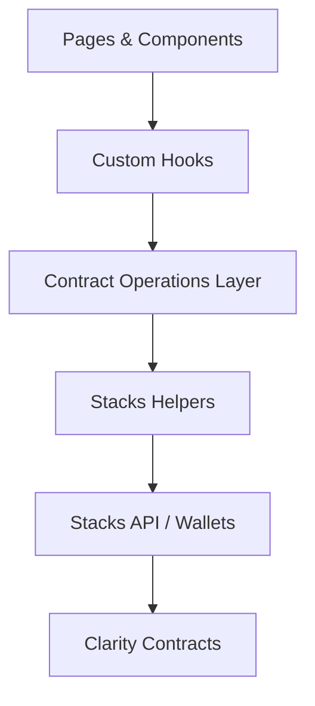

# Front-end (Next.js)

Feature-rich Next.js 14 app that surfaces the Rather Strategy contracts: marketplace listings, strategy treasury metrics, liquidity pool stats, and gated admin utilities.

## Highlights

- App Router build with Chakra UI theming and custom color system.
- Network-aware hooks switch between devnet, testnet, and mainnet configurations.
- Wallet UX that supports Hiro-compatible browser wallets and built-in devnet seed switching.
- Admin portal guarded so only the deployer principal sees the navigation and page on testnet.
- Marketplace cards and holdings automatically render NFT art from on-chain token URIs.

## Architecture



## Directory map

```
src/
├── app/                 # App Router pages (landing, marketplace, liquidity, strategy, admin)
├── components/          # UI building blocks and wallet/network providers
├── constants/           # Contract address/name helpers
├── hooks/               # Reusable data hooks (wallet, holdings, network)
├── lib/                 # Stacks.js contract operations + network utilities
└── utils/               # Formatting helpers and explorer link builders
```

## Environment variables

The app reads env vars prefixed with `NEXT_PUBLIC_`. Create `front-end/.env` and export at least:

```env
NEXT_PUBLIC_STACKS_NETWORK=testnet
NEXT_PUBLIC_TESTNET_DEPLOYER=<principal that deployed contracts>
NEXT_PUBLIC_TESTNET_NFT_CONTRACT_NAME=funny-dog
NEXT_PUBLIC_TESTNET_MARKETPLACE_CONTRACT_NAME=nft-marketplace
NEXT_PUBLIC_TESTNET_STRATEGY_CONTRACT_NAME=strategy-token
NEXT_PUBLIC_TESTNET_POOL_CONTRACT_NAME=liquidity-pool
```

For devnet work you can also supply:

- `NEXT_PUBLIC_PLATFORM_HIRO_API_KEY` – used to hit Hiro hosted devnet endpoints.
- `NEXT_PUBLIC_DEVNET_HOST` – set to `platform` or `local` to toggle provider URLs.

## Scripts

```bash
npm run dev      # Start Next.js in development mode
npm run build    # Production build
npm run start    # Serve the production build locally
npm run lint     # ESLint is configured, but may require resolving react-hooks warnings
```

## Wallet & admin behaviour

- The navbar displays the **Admin** link only when the connected wallet matches the strategy deployer on testnet; the page itself repeats the check and shows a restricted message otherwise.
- On devnet, a built-in wallet switcher surfaces a list of seeded accounts from `lib/devnet-wallet-context.ts`.
- Hiro/Leather/Xverse users can connect via the `ConnectWallet` component; contract calls fallback to direct signing on devnet when `shouldUseDirectCall()` detects the local environment.

## Data flow

- Read-only queries use `@stacks/blockchain-api-client` via helpers in `lib/stacks-api.ts`.
- Contract write operations are defined once in `lib/<domain>/operations.ts` and invoked from components via React hooks.
- NFT preview images are fetched through the `TokenImage` component which resolves SIP-009 URIs and renders via `next/image`.

## Development workflow

1. Ensure the front-end `.env` matches the principals of the currently deployed contracts.
2. Start `npm run dev` and browse the landing page at `http://localhost:3000`.
3. Use the network selector in the navbar to confirm you are on testnet or devnet as expected.
4. Connect a wallet and exercise the dashboard, marketplace, liquidity, and admin flows.

Refer back to the [root README](../README.md) for full-stack setup instructions and contract deployment steps.
